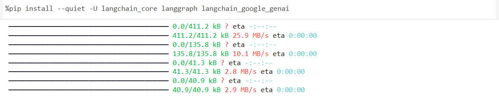
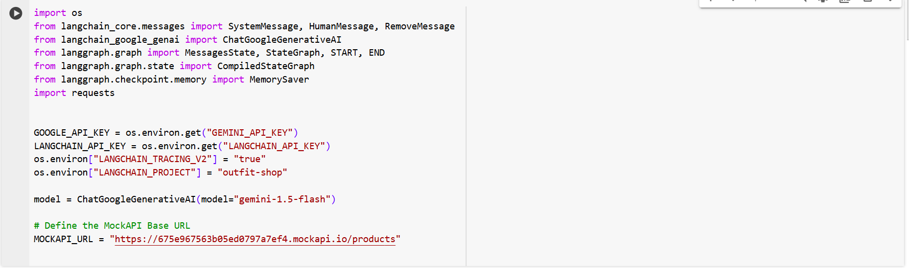

# Clothe Agent By Abu Bakar :

i created a e-commerce customer support agent for boys using Python LangGrpah Gemini_Api_Key mockApi
[Live On Google Colab](https://colab.research.google.com/drive/1wAoalirah4GNr-t1Bx6HTA6Bk5EEu7ah?usp=sharing)

# Step By Step Guide : 

# First Install The Requirements

### After This Step Import The Following Then Setup Your Api_Key in Google Colab Secrets Langchain_Api_Key Gemini_Api_Key

